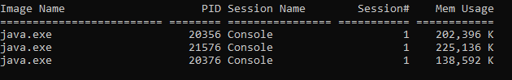
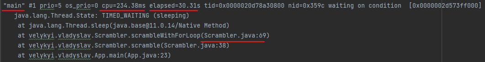

##Demo project for troubleshooting of blocked threads
###The approach of research by means of collecting of thread dumps is shown in this project.

To use the approach we need to run our application and find the corresponding java-task.
1. Open cmd.exe and run `tasklist /fi "imagename eq java.exe"`

 We can find all tasks that running with java:

2. Find the needed process and run: `jcmd <procces id> Thread.print >vladyslavs_thread_dump.velykyi`.

This will save the capture of thread dumps.

In this case, we found out what exactly causes thread sleeping(vladyslavs_thread_dump1.velykyi file).

3. After capturing we can analyze the reason.

###Additional technic to troubleshoot the thread dumps
- Java Mission Control
- Java Flight Recorder
- Microbenchmarks in Java with JHM
